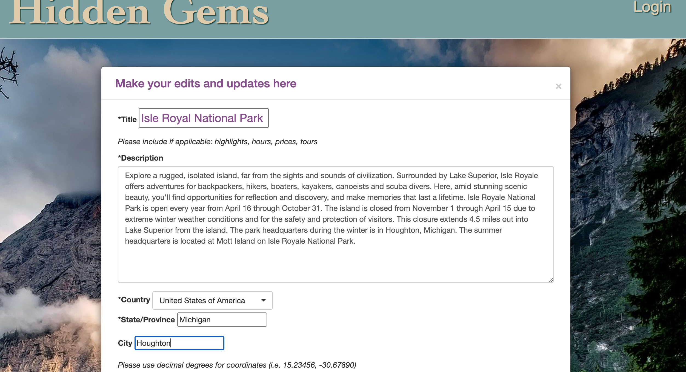
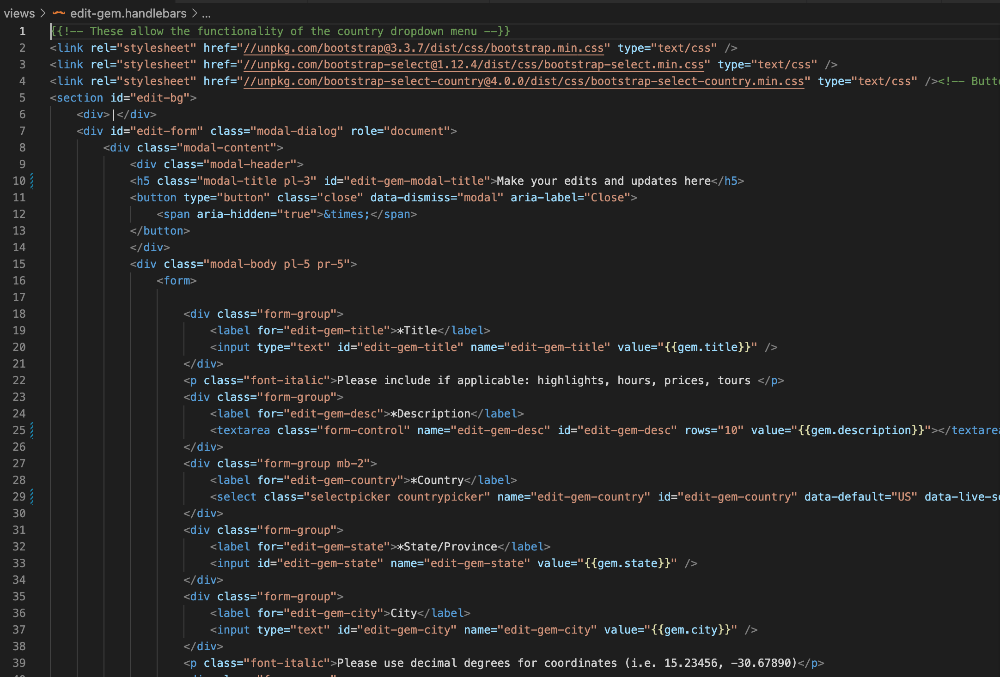
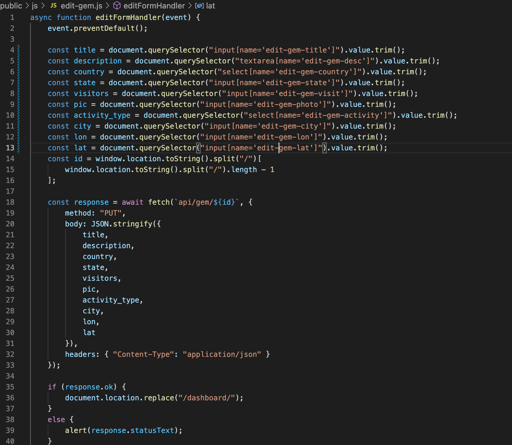
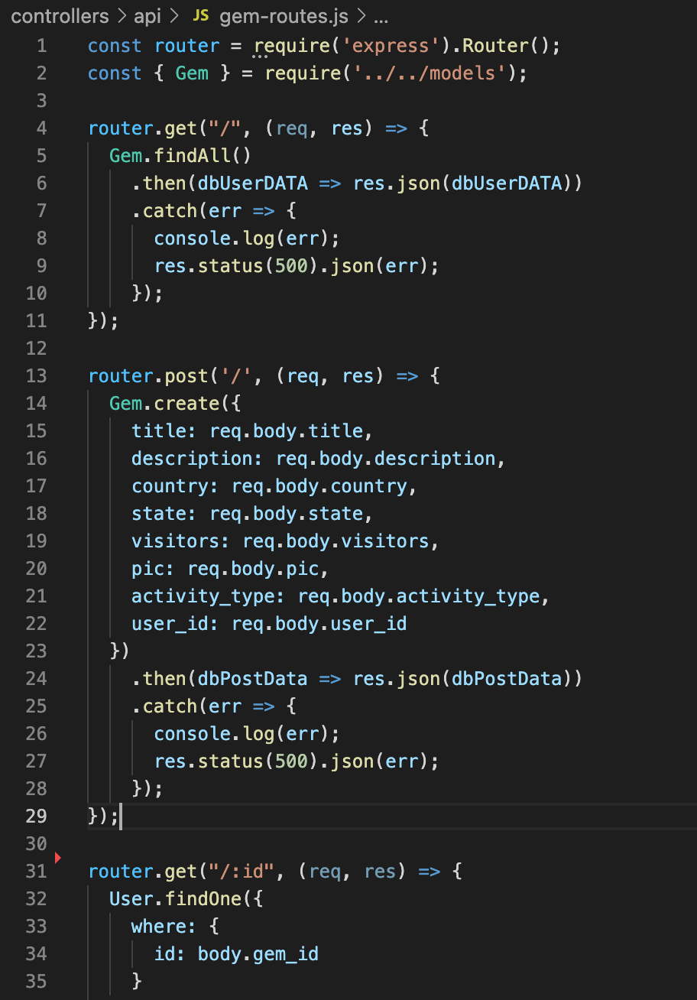
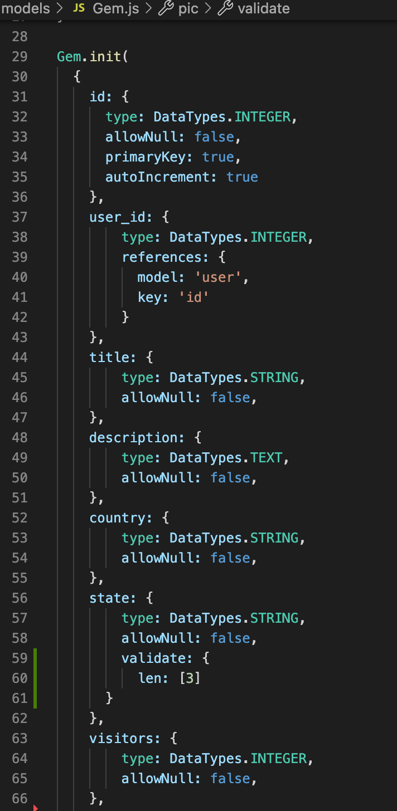

# Hidden-Gems

        

## Table of Contents
- [Description](#description)
- [Installation](#installation)
- [Usage](#usage)
- [Credits](#credits)
- [Contributing](#contributing)
- [Tests](#tests)
- [Questions](#questions)
- [Additions](#additions)
- [License](#license)  
        

## Description

AS A person who loves to explore and avoid crowds, 

I WANT a site that allows me to discover places to explore that are fascinating and not well-known

SO THAT I can plan a great vacation.

Hidden Gems is a site where users can create an account and post different great places to tour or visit on vacation. Users will add a name of the site, location, city, state, country, visitorship, pictures, and a description. The homepage will show the top liked spots in the form of cards that include the title and picture. Users can also like and comment on whatever gem they choose. All locations must have less than 100,000 visitors per year. When the user clicks on the card, it will take the user to that location's page where all the info and comments are. There will also be a dashboard where logged-in users can change profile information, add gems, delete gems, and edit gems.

Once complete, the program should operate so that:

WHEN I check the dependencies,

THEN I see that Node.js and Express.js were used to create a RESTful API.

WHEN I check the views folder,

THEN I find that Handlebars.js was used as the templating engine.

WHEN I check the models and controllers folder,

THEN I can confirm that MySQL and the Sequelize ORM were used for the database.

WHEN I look at the routes, 

THEN I find both GET and POST routes for retrieving and adding new data.

WHEN I want to open the application,

THEN I can do it by visiting the Heroku site and find that there is already data in it.

WHEN I look at the dependencies, 

THEN I find at least one new library, package, or technology that we haven’t discussed being used.

WHEN I interact with the application,

THEN I get the feeling that the application is responsive, interactive, and has a polished UI.

WHEN I check the folder structure,

THEN I see that it meets the MVC paradigm.

WHEN I log onto the site,

THEN I go through some kind of authentication (express-session and cookies).

WHEN I try to get any API keys or sensitive information,

THEN I find they've been protected with environment variables.

WHEN I check the repository,

THEN I see it's clean and meets quality coding standards (file structure, naming conventions, best practices for class/id naming conventions, indentation, quality comments, etc.).

WHEN I look at the README,

THEN I see it is of high quality, including a unique name, description, technologies used, screenshot, and link to deployed application).

By creating this application, we hope that some of the lesser-known opportunities get their due, and that we improve the quality of vacation our users go on. 

For us, the project is meant to not only test our coding abilities from start to finish and encapsulate all the skills and tools we've learned, but more importantly, our ability to stay organized and work together. In a professional environment, division of labor and integration of multiple people's contributions are a critical and typical part of daily life. Maintaining organized file and code and good communication with issues and github activity is one of the biggest tests this project poses.

Work was split in the following ways:

Will: Handlebars, CSS, utils, models, README.

Ryanne: All Controllers, Presentation

David: Wireframe, Seeds, front-end JS

We aimed to each work on our separate parts and meld them together later in the development stage, using hardcoding for handlebars and Insomnia for the controllers to make sure everything worked before pushing it. 

## Installation

Links to the repository and the deployed page can be found at [Questions](#questions).

While this project's repository is available on Github, the site it deployed to Heroku. If you clone the repo you must run the command "npm install" on the Terminal/Command Line and download the dependencies, all of which are mentioned in [Credits](#credits).

## Usage

Once the project is cloned and the dependencies downloaded, type "npm start" to run the program. 

A screenshot of the program in action is shown below, at the home screen, editing a gem, and logging in;

<!-- ADD IMAGES -->
Screenshots of the edit-gem.handlebars file, edit-gem.js, gem-routes.js, and model files are below, displaying the steps submitting a gem takes: 

## Credits

The coding boot camp Professional README Guide found at https://coding-boot-camp.github.io/full-stack/github/professional-readme-guide was used as a template for this README. The license was picked from [https://choosealicense.com/](https://choosealicense.com/).The WHEN/THEN section of this README was based off the project assignment Acceptance Criteria. Most influence was taken from Just-Tech-News of Modules 13 and 14. Stack Overflow, MDN Web Docs, W3, and Google were critical to our success. Bootstrap, JQuery, MySql, Node.js, Insomnia, NPM, Express.js, express-session, Handlebars, Sequelize, bcrypt, and dotenv were used. Pixabay was used for stock photos. Bootstrap-select-country, created by mojoaxel, was implemented in the Add-Gem form. Icons were created by Freepik and deemakdaksina and downloaded from Flaticon. JAWSDB and Simple File Upload were also added to our heroku app to allow our app to function on heroku and let users upload images, respectively. Jack Storrs provided the boilerplate for the project, which was much appreciated. 

Special Thanks to the following for their input and help:
Jack (Instructor)
Luiz (TA)
Luke (TA)
Sandra (TA)

## Contributing

If you make changes, test it locally on a branch before pushing to main. Clone from the github site and make sure to create your own .env file with your own credentials.

## Additions

First, refactoring is always welcome. When filling out forms, adding further catches to make sure the information we get is accurate and up to form would improve user experience and the database. Examples include having a dropdown for states if the gem location is in the USA, adding an ability to add other activities besides simply labeling "other," turning missing required fields red if the user submits an unfinished gem, making sure downloaded pictures have suitable dimensions, adding alt text for the uploaded photos, and adding an "are you sure?" modal when the delete gem button is clicked. 
Some of the bigger improvements to be made include the following:
    -adding maps to each gem so the user can see its location better (MapBox is probably the best option)
    -adding the ability to favorite a gem, and then, if you go to the home page, populating the body with favorite gems instead of top-voted gems. 
    -adding a search bar and the ability to search for gems based on state, country, and activity
    -adding an entire sister site titled "Local Gems," where the focus is more city-based rather than tourism-based (looking for hole-in-the-wall restaurants, unknown activities and shops, etc.)
    -adding profile pictures
    -adding ability to submit more than one photo per gem, and coming up with a good way to cycle through them

## Tests

No Jest tests written were made for this project, but Insomnia is a critical tool in letting you test the program's GET, POST, PUT, and DELETE methods. If you want to run tests, download Insomnia or some similar program, activate the program in Terminal using "npm start", and then use the Localhost URL to try the different methods.

## Questions

The github repository to this project is below:

[https://github.com/rbenne30/Hidden-Gems.git](https://github.com/rbenne30/Hidden-Gems.git)

The application is deployed on Heroku. The site is below:

[https://thawing-springs-82201.herokuapp.com/](https://thawing-springs-82201.herokuapp.com/)

For any additional questions, we can be reached at the following

Will Duncan: willdunc12@gmail.com
Github: [https://github.com/willjduncan](https://github.com/willjduncan)

Ryanne Bennett: ryannebennett1@outlook.com
Github: [https://github.com/rbenne30](https://github.com/rbenne30)

David Shaw: hawkhilt@gmail.com
Github: [https://github.com/Obtains](https://github.com/Obtains)

## License

[view license link here](https://choosealicense.com/licenses/mit/)

        
MIT License

Copyright (c) [2022] [willjduncan, rbenne30, and Obtains]

Permission is hereby granted, free of charge, to any person obtaining a copy
of this software and associated documentation files (the "Software"), to deal
in the Software without restriction, including without limitation the rights
to use, copy, modify, merge, publish, distribute, sublicense, and/or sell
copies of the Software, and to permit persons to whom the Software is
furnished to do so, subject to the following conditions:

The above copyright notice and this permission notice shall be included in all
copies or substantial portions of the Software.

THE SOFTWARE IS PROVIDED "AS IS", WITHOUT WARRANTY OF ANY KIND, EXPRESS OR
IMPLIED, INCLUDING BUT NOT LIMITED TO THE WARRANTIES OF MERCHANTABILITY,
FITNESS FOR A PARTICULAR PURPOSE AND NONINFRINGEMENT. IN NO EVENT SHALL THE
AUTHORS OR COPYRIGHT HOLDERS BE LIABLE FOR ANY CLAIM, DAMAGES OR OTHER
LIABILITY, WHETHER IN AN ACTION OF CONTRACT, TORT OR OTHERWISE, ARISING FROM,
OUT OF OR IN CONNECTION WITH THE SOFTWARE OR THE USE OR OTHER DEALINGS IN THE
SOFTWARE.